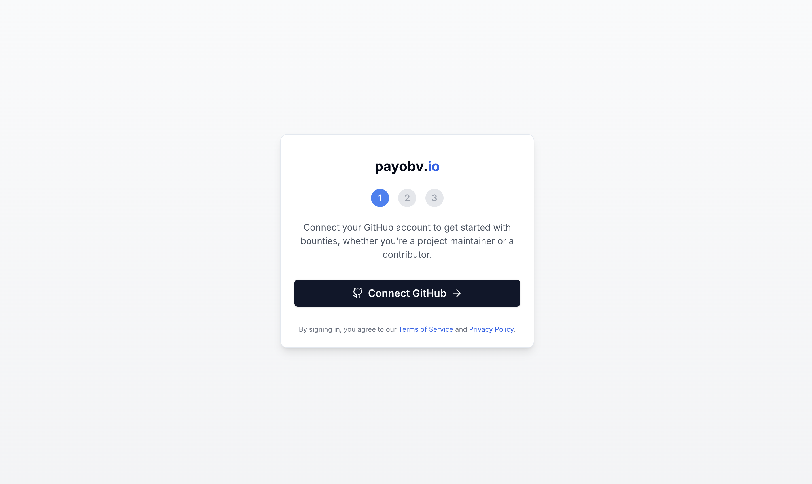
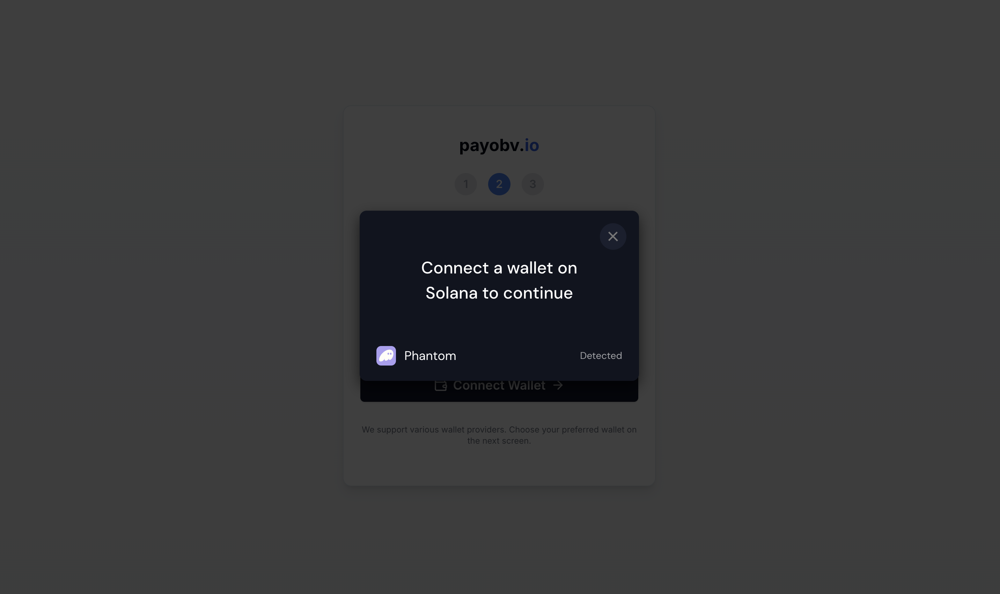
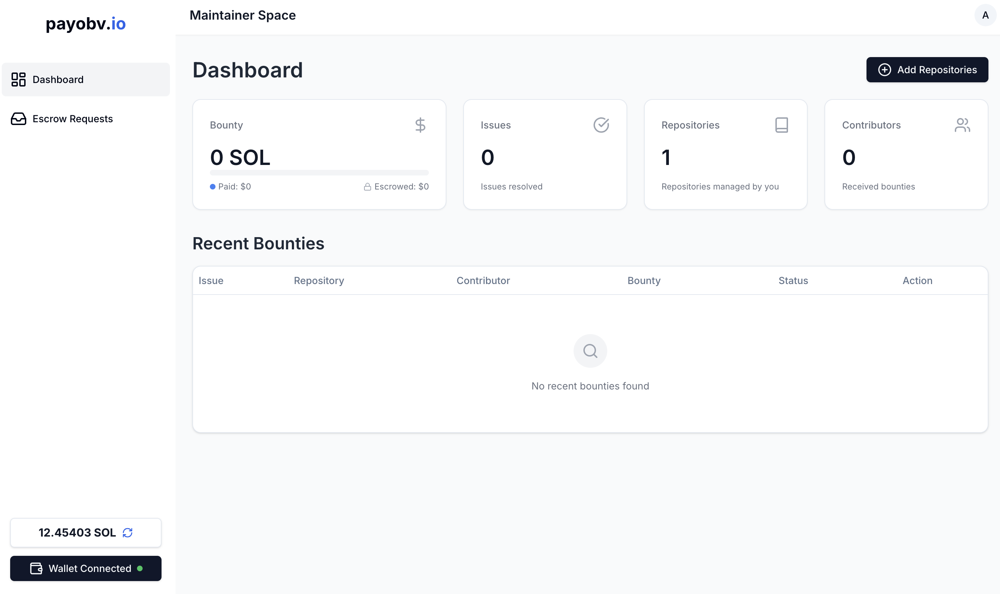
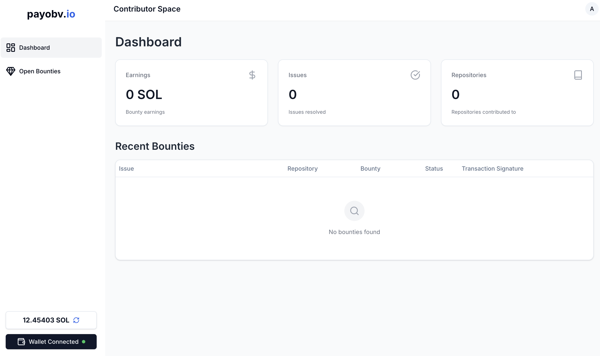
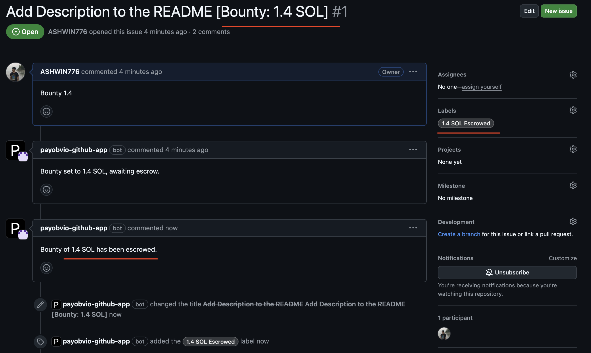
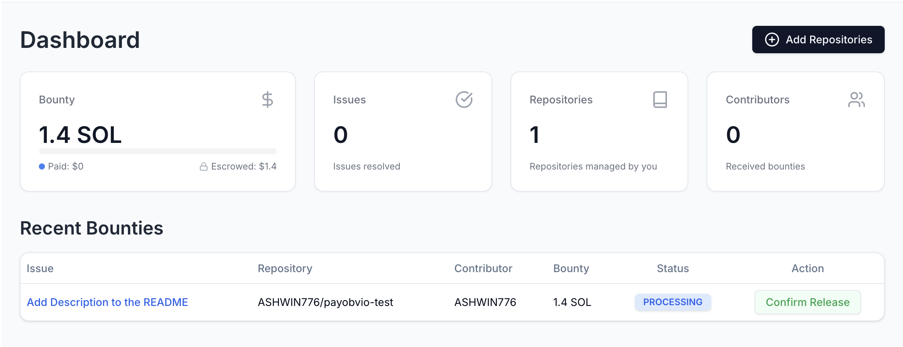

# payobv.io - Obvious Payments for Open Source Contributors

[payobv.io](https://payobv-io-ten.vercel.app/) is a platform that allows open source contributors to receive bounties from users of their projects. It is a simple and transparent way to support the people who create the software you use every day.

## 📝 Overview

> The project can be found [here](https://payobv-io-ten.vercel.app/)

Below are the steps to use the platform:

1. **Onboarding Proceess**: The user has to complete the onboarding process by doing the following:
   - Connect their GitHub account
   - Connect Wallet
   - Select Role (Project Maintainer or Contributor)
   - Install our Github App and add repositories(only for Project Maintainers)
2. **Opening an Issue and Setting Bounty**: The Project Maintainer can open an issue and set a bounty on it. The bounty should be set in the Issue body or in the comments. 

> ❗Note: The bounty should be in the format `Bounty <amount in sols>`

3. **Escrow**: The Project Maintainer can escrow the bounty by clicking on the `Approve` button in [Escrow Requests](https://payobv-io-ten.vercel.app/escrow-requests) page and finish the transaction. The bounty will be locked in the escrow account.

4. **Contributing to the Issue**: The Contributors can contribute to the issue by submitting a PR. The Project Maintainer can review the PR and merge it. 

While opening the PR, the Contributor should reference the issue in the PR body.

> ❗Note: The issue reference should be in the format `Issue #<issue number>`

5. **Contributor Onboarding**: The Contributor has to complete the onboarding process.

6. **PR Merge and Bounty Release Initiation**: The Project Maintainer can merge the PR and release the bounty by clicking on the `Confirm Release` button in the [Dashboard](https://payobv-io-ten.vercel.app/maintainer/dashboard).

7. **Bounty Release**: The bounty will be released to the Contributor's wallet.

## 📝 Project Showcase

Below are the steps to use the platform:

### 💰 Step 1: User starts the onboarding process on our platform

Onboarding 1: Connect your GitHub account

Onboarding 2: Connect your Solana wallet

Onboarding 3: Selecting Roles.

The user can select the following roles:
1. **Project Maintainer**: Manage projects and bounties. If selected, you will be redirected to out github app installation page, where you can select the repositories you manage.
2. **Contributor**: Contribute to projects and earn bounties. If selected, you will be redirected to your dashboard.

This is how the maintainer dashboard looks like when there are no bounties opened.

This is how the contributor dashboard looks like when there are no bounties opened.

---

### 🔖 Step 2: Project Maintainer opens an issue and sets a bounty

The process for setting a bounty is as follows:
1. Open an issue on the repository (Make sure that out github app is installed on your repository).
2. Set a bounty on the issue. The bounty is set in SOL.

> ❗Note: The bounting setting format is `Bounty <amount>`

As soon as the issue is opened, and bounty is set, you can see that the Github App has commented on the issue.

Although the bounty is set, we want the maintainer to escrow the bounty. This is done from our platform.

---

### 🔖 Step 3: Project Maintainer escrows the bounty

The process for escrowing the bounty is as follows:
1. Go to the [Escrow Requests page](https://payobv-io-ten.vercel.app/maintainer/escrow-requests)
2. Approve the escrow request.

Click on the approve button to escrow the bounty.
After the transaction is successful, you can see that the bounty is escrowed.

Going back to the Github Issue, you can see the following changes in the bountied issue:
1. Escrowed Label added
2. Title Modified to: `<Issue Title> [Bounty: <amount>]`
3. Bot Comment: `Bounty of <amount> SOL has been escrowed`

---

### 🔖 Step 4: Contributor Solved the Issue and opens a PR

While opening the PR, the Contributor should reference the issue in the **PR body**.

> ❗Note: The issue reference should be in the format `Issue #<issue number>`

As soon as the PR is opened, the Github App will comment on the PR.

The contributor should follow the instructions, and finish the omboarding process.

---

### 🔖 Step 5: Project Maintainer reviews the PR and merges it

Once the PR is merged, the Issue is updated by the Github App with the following changes:
1. Comment added for the Maintainer to check the [Dashboard](https://payobv-io-ten.vercel.app/maintainer/dashboard)
2. `Awaiting Escrow Release` label added
3. Issue is closed

---

### 🔖 Step 6: Project Maintainer releases the escrow

The process for releasing the escrow is as follows:
1. Go to the [Maintainer Dashboard](https://payobv-io-ten.vercel.app/maintainer/dashboard)
2. Click on the `Confirm Release` button against the issue, and confirm the release.

After the transaction is successful, you can see that the bounty is released.

The Contributor's Dashboard is also updated with the bounty received.

The Github App also comments on the issue with an appreciation message and paid bounty update, and also updates label.

