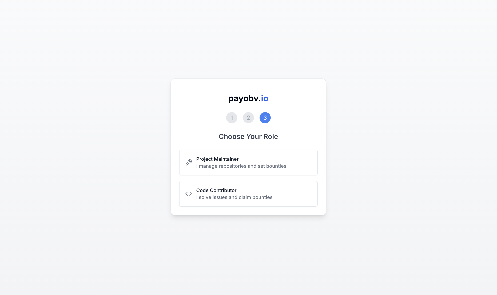
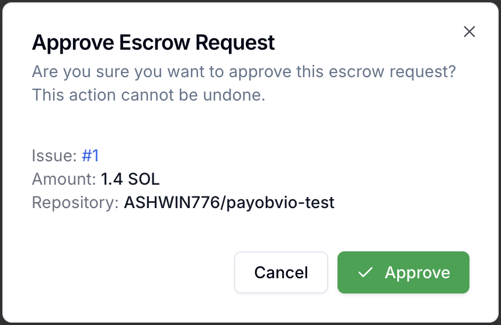
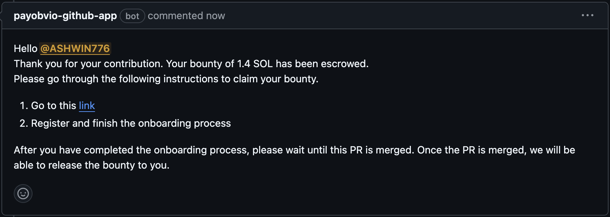
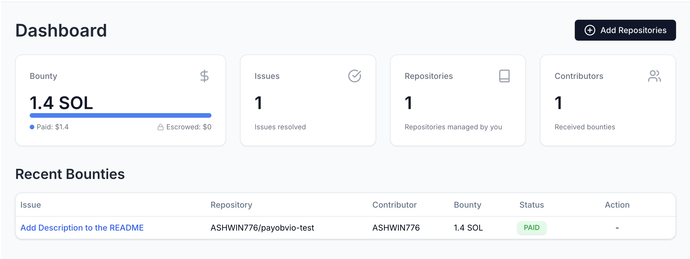
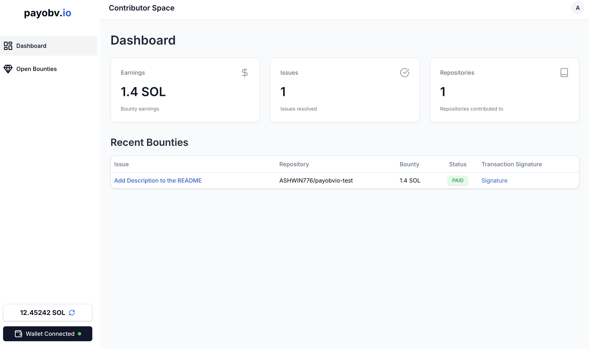

## Project Showcase

> The project can be found [here](https://payobv-io-ten.vercel.app/)

Below are the steps to use the platform:

### Step 1: User starts the onboarding process on our platform

Onboarding 1: Connect your GitHub account

Onboarding 2: Connect your Solana wallet

Onboarding 3: Selecting Roles.

The user can select the following roles:
1. **Project Maintainer**: Manage projects and bounties. If selected, you will be redirected to out github app installation page, where you can select the repositories you manage.
2. **Contributor**: Contribute to projects and earn bounties. If selected, you will be redirected to your dashboard.

This is how the maintainer dashboard looks like when there are no bounties opened.

This is how the contributor dashboard looks like when there are no bounties opened.

### Step 2: Project Maintainer opens an issue and sets a bounty

The process for setting a bounty is as follows:
1. Open an issue on the repository (Make sure that out github app is installed on your repository).
2. Set a bounty on the issue. The bounty is set in SOL.

> ❗Note: The bounting setting format is `Bounty <amount>`

As soon as the issue is opened, and bounty is set, you can see that the Github App has commented on the issue.

Although the bounty is set, we want the maintainer to escrow the bounty. This is done from our platform.

### Step 3: Project Maintainer escrows the bounty

The process for escrowing the bounty is as follows:
1. Go to the [Escrow Requests page](https://payobv-io-ten.vercel.app/maintainer/escrow-requests)
2. Approve the escrow request.

Click on the approve button to escrow the bounty.
After the transaction is successful, you can see that the bounty is escrowed.

Going back to the Github Issue, you can see the following changes in the bountied issue:
1. Escrowed Label added
2. Title Modified to: `<Issue Title> [Bounty: <amount>]`
3. Bot Comment: `Bounty of <amount> SOL has been escrowed`

### Step 4: Contributor Solved the Issue and opens a PR

While opening the PR, the Contributor should reference the issue in the **PR body**.

> ❗Note: The issue reference should be in the format `Issue #<issue number>`

As soon as the PR is opened, the Github App will comment on the PR.

The contributor should follow the instructions, and finish the omboarding process.

### Step 5: Project Maintainer reviews the PR and merges it

Once the PR is merged, the Issue is updated by the Github App with the following changes:
1. Comment added for the Maintainer to check the [Dashboard](https://payobv-io-ten.vercel.app/maintainer/dashboard)
2. `Awaiting Escrow Release` label added
3. Issue is closed

### Step 6: Project Maintainer releases the escrow

The process for releasing the escrow is as follows:
1. Go to the [Maintainer Dashboard](https://payobv-io-ten.vercel.app/maintainer/dashboard)
2. Click on the `Confirm Release` button against the issue, and confirm the release.

After the transaction is successful, you can see that the bounty is released.

The Contributor's Dashboard is also updated with the bounty received.

The Github App also comments on the issue with an appreciation message and paid bounty update, and also updates label.

